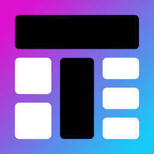

**Tileio App**: <a href="https://ambiqai.github.io/tileio" target="_blank">https://ambiqai.github.io/tileio</a>

**Documentation**: <a href="https://ambiqai.github.io/tileio-docs" target="_blank">https://ambiqai.github.io/tileio-docs</a>

**Source Code**: <a href="https://github.com/AmbiqAI/tileio" target="_blank">https://github.com/AmbiqAI/tileio</a>

# Tileio

Tileio is a powerful application to create highly customizable dashboards for streaming real-time data from edge IoT devices. By leveraging a domain-agnostic API, along with highly customizable dashboard and tile configurations, Tileio can be used to create tailored demos for a wide range of applications.

 

- **[Getting Started](https://ambiqai.github.io/tileio-docs/)**: Learn how to install and use Tileio.
- **[Usage Examples](https://github.com/AmbiqAI/tileio-demos)**: See full demos of Tileio in action
- **[API Documentation](https://ambiqai.github.io/tileio-docs/api)**: Explore the API
- **[Explore Guides](https://ambiqai.github.io/tileio-docs/guides)**: View in-depth guides on creating a custom demo

## Overview

Tileio discovers and communicates to devices (e.g. Apollo4 Blue EVB) via **webBLE** or **webUSB**. A device streams data to Tileio through designated **slots**. At a high-level a **slot** consists of a set of similar signals (e.g. accelerometer) captured at the same sampling rate (e.g. 100 Hz). More specifically, a **slot** consists of two components: (1) a set of **channels** (e.g. X, Y, Z) along with a **mask** and (2) a set of **metrics**. A device can have up to 4 slots with each slot having up to 4 channels and up to 60 metrics.

Beyond streaming data, Tileio also provides a generic I/O (input/output) control interface that can be used to interact with the device. The interface consists of 8 configurable I/O elements that be configured as buttons, toggle switches, sliders, and select boxes.
